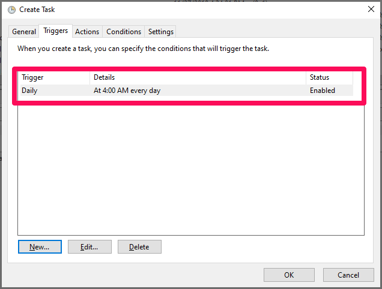

# RouterManager
Use Selenium WebDriver to manage a NetGear router

## Example:
To peek the usage:
```
RouterCommand.exe --help
```

To block a device
```
RouterCommand.exe -d EchoShow -c Blocked
```


To allow a device
```
RouterCommand.exe -d EchoShow -c Allowed
```

## Set up as a Windows Scheduled Task
Open **Task Scheduler**,

Create a new Task.


Set New Trigger to be "On a schedule".



Action is set to "Start a program".

Use `RouterCommand.exe` as the Program and `-d EchoShow -c Blocked` as arguments.


In the same way, set up another job called **Allow EchoShow**.


Make sure both tasks have a status of **Ready**.

